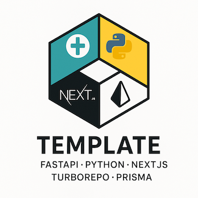

# FastAPI/NextJS/Postgres + Prisma Turborepo for Multi-tenant SaaS AI Apps

This template provides a modern, full-stack SaaS application boilerplate for multi-tenant AI apps built with FastAPI and Next.js, designed for rapid development and scalability. It combines the best practices of both Python and TypeScript ecosystems to create a robust, type-safe, and performant application.

## Support the Project

If you find this template helpful, consider:

- Starring the repository
- Contributing to the codebase
- Sharing with your network
- Following for updates

### Good projects have great scaffolding

#### FastAPI • SQLModel • Next.js • TypeScript • Python • PostgreSQL via Supabase • Prisma ORM • Docker • Turborepo • Vercel Hosting • Supabase Auth (optional) • ZOD Schemas • Docker

<!-- markdownlint-disable MD033 -->

  
  
  
  
  
  
  
  
  
  
  

<!-- markdownlint-disable MD033 -->

  

## Key Features

- **Full-Stack Type Safety**: TypeScript for frontend and Python type hints for backend
- **Modern Authentication**: Built-in auth system with [FastAPI Auth](https://fastapi-auth.github.io/) and [Supabase Auth](https://supabase.com/auth) for seamless authentication
- **Database Management**: [Prisma](https://www.prisma.io/) ORM for type-safe database operations
- **API Documentation**: Auto-generated [OpenAPI](https://swagger.io/specification/) documentation
- **Testing Infrastructure**: Comprehensive testing with [Pytest](https://docs.pytest.org/) and [Jest](https://jestjs.io/)
- **CI/CD Pipeline**: [GitHub Actions](https://docs.github.com/en/actions) workflow for automated testing and deployment
- **Monorepo Structure**: [Turborepo](https://turbo.build/repo) for efficient workspace management
- **Caching Layer**: [Redis](https://redis.io/) integration for improved performance
- **Containerization**: [Docker](https://www.docker.com/) support for consistent development and deployment

## Use Cases

- Building scalable SaaS applications
- Creating RESTful APIs with automatic documentation
- Developing type-safe full-stack applications
- Setting up a production-ready development environment
- Implementing modern authentication and authorization
- Managing complex database operations with type safety
- Multi-tenant application with secure data isolation

## Technology Stack

### Backend

- **[FastAPI](https://fastapi.tiangolo.com/)**: High-performance web framework for building APIs with Python
- **Python 3.11+**: Latest stable Python version with enhanced type hints
- **[Pydantic](https://docs.pydantic.dev/)**: Data validation and settings management
- **[SQLModel](https://sqlmodel.tiangolo.com/)**: SQL database library for Python, with SQLAlchemy core and Pydantic
- **[FastAPI Auth](https://fastapi-auth.github.io/)**: Authentication and authorization library
- **[Loguru](https://github.com/Delgan/loguru)**: Advanced logging library with better exception handling and formatting

### Frontend

- **[Next.js 14](https://nextjs.org/)**: React framework with App Router and Server Components
- **[TypeScript 5](https://www.typescriptlang.org/)**: Static type checking for JavaScript
- **[shadcn/ui](https://ui.shadcn.com/)**: Re-usable components built with Radix UI and Tailwind CSS
- **[Tailwind CSS](https://tailwindcss.com/)**: Utility-first CSS framework
- **[React Query](https://tanstack.com/query/latest)**: Data fetching and caching library
- **[Zustand](https://github.com/pmndrs/zustand)**: State management solution
- **[React Hook Form](https://react-hook-form.com/)**: Form validation and handling
- **[Zod](https://zod.dev/)**: Schema validation
- **[Winston](https://github.com/winstonjs/winston)**: Versatile logging library for Node.js

### Database & Caching

- **[PostgreSQL 15](https://www.postgresql.org/)**: Advanced open-source database (powered by [Supabase](https://supabase.com/) for managed PostgreSQL and authentication)
- **[Prisma](https://www.prisma.io/)**: Type-safe ORM for database operations with built-in connection pooling
- **[Redis 7](https://redis.io/)**: In-memory data structure store for caching

### DevOps & Infrastructure

- **[Docker](https://www.docker.com/)**: Containerization platform
- **[GitHub Actions](https://docs.github.com/en/actions)**: CI/CD automation
- **[Turborepo](https://turbo.build/repo)**: High-performance build system
- **[Nginx](https://www.nginx.com/)**: Web server and reverse proxy
- **[Prometheus](https://prometheus.io/)**: Monitoring and alerting
- **[Grafana](https://grafana.com/)**: Metrics visualization
- **[ELK Stack](https://www.elastic.co/what-is/elk-stack)**: Log aggregation and analysis (Elasticsearch, Logstash, Kibana)

### Docker Setup

The project uses Docker for containerization and development. The setup includes:

#### Development Environment

- **Docker Compose**: Orchestrates multiple services for local development
- **Hot Reload**: Automatic code reloading for both frontend and backend
- **Volume Mounting**: Persistent storage for development data
- **Environment Variables**: Secure configuration management

#### Production Environment

- **Multi-stage Builds**: Optimized container images for production
- **Security**: Non-root user execution and minimal dependencies
- **Health Checks**: Container health monitoring
- **Resource Limits**: CPU and memory constraints

#### Services

- **API Service**: FastAPI application with Gunicorn
- **Web Service**: Next.js application with Node.js
- **Database Service**: PostgreSQL with persistent storage
- **Cache Service**: Redis for session management
- **Nginx Service**: Reverse proxy and static file serving

### Email Service

- **[Mailgun](https://www.mailgun.com/)**: Transactional email service for password reset and notifications
  - SMTP and API-based email delivery
  - Email templates for consistent branding
  - Delivery tracking and analytics
  - Spam protection and domain authentication
  - Rate limiting and throttling controls

#### Email Templates

- **Password Reset**: Secure token-based password reset flow
- **Welcome Email**: New user onboarding
- **Notification Emails**: System alerts and updates
- **Marketing Emails**: Optional promotional content

#### Security Features

- DKIM and SPF authentication
- TLS encryption for email transmission
- Rate limiting to prevent abuse
- IP allowlisting for trusted senders
- Bounce and complaint handling

### Environment Management

The project uses a comprehensive environment management system to handle different deployment scenarios and configurations.

#### Environment Variables

- **Development**: `.env.development` for local development
- **Testing**: `.env.test` for CI/CD pipeline
- **Production**: `.env.production` for live deployment
- **Shared**: `.env.shared` for common variables

#### Variable Categories

- **Database**: Connection strings and credentials
- **Authentication**: JWT secrets and OAuth keys
- **External Services**: API keys and endpoints
- **Application**: Feature flags and configuration
- **Security**: Encryption keys and certificates

#### Security Best Practices

- Never commit `.env` files to version control
- Use environment-specific variable files
- Implement variable validation using Zod
- Encrypt sensitive values in production
- Rotate credentials regularly

#### Deployment Process

1. **Automatic Deployments**

   - Triggered by pushes to main branch
   - Preview deployments for pull requests
   - Branch-specific deployments

2. **Environment Configuration**

   - Vercel dashboard for environment variables
   - Production and preview environments
   - Secret management for sensitive data

3. **Build Settings**

   - Framework preset: Next.js
   - Build command: `npm run build`
   - Output directory: `.next`
   - Node.js version: 18.x

4. **Performance Optimization**

   - Edge Network distribution
   - Automatic HTTPS
   - Image optimization
   - Serverless functions

5. **Monitoring and Analytics**
   - Real-time performance metrics
   - Error tracking
   - Analytics integration
   - Deployment logs

#### GitHub Actions and CI

1. **Continuous Integration Pipeline**

   - Automated e2e testing on pull requests
   - Branch protection rules
   - Code quality checks
   - Security scanning

2. **Backend CI Workflow**

   - Python 3.12 environment setup
   - Poetry dependency management for python backend
   - PostgreSQL 15 service container
   - Redis 7 service container
   - Pytest test execution
   - Code coverage reporting

3. **Frontend CI Workflow**

   - Node.js environment setup
   - NPM dependency installation
   - Jest test execution
   - TypeScript type checking
   - Build verification
   - Bundle analysis

4. **CI Configuration**

   - Automated testing
   - Service containers
   - Dependency caching
   - Parallel job execution
   - Artifact management

5. **Quality Gates**

   - Test coverage thresholds
   - Type checking requirements
   - Linting standards
   - Security scanning
   - Performance benchmarks

## Meet Mac Anderson

This template was created by [Mac Anderson](https://macanderson.com), a full-stack developer specializing in AI/ML systems. With experience in building and scaling successful startups, Mac is dedicated to creating robust applications and sharing technical knowledge with the developer community.

### Connect with Mac

- **Mac Anderson's LinkedIn**: [Mac Anderson's LinkedIn Profile](https://linkedin.com/in/macanderson)
- **Mac Anderson's Devfolio & Personal Blog**: [macanderson.com](https://macanderson.com) - Technical articles, project showcases, and development insights
- **02Beta.com**: [02Beta.com](https://02beta.com) - Resources for Engineer Entrepreneurs
- **Follow me on X**: [Mac X Account](https://x.com/macandersoncto)
- **Follow me on Instagram**: [Mac Instagram](https://instagram.com/macandersoncto)
